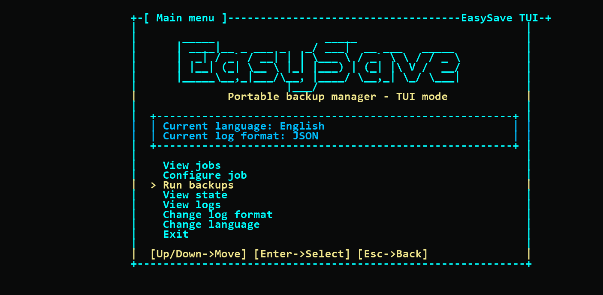

# EasySave - Groupe 1

EasySave est une application console .NET 8 qui permet de gérer jusqu'à cinq tâches de sauvegarde.
Elle prend en charge les sauvegardes complètes et différentielles, conserve l'état d'exécution au format JSON et génère des journaux de transfert quotidiens avec la bibliothèque `EasyLog`.

La version `1.1.0` introduit une nouvelle interface TUI plus graphique, basée sur des menus interactifs au clavier.

---

## Sommaire

* [Fonctionnalités](#fonctionnalités)
* [Mode TUI graphique](#mode-tui-graphique)
* [Utilisation en ligne de commande](#utilisation-en-ligne-de-commande)
* [Fichiers d'exécution](#fichiers-dexécution)
* [Support des langues](#support-des-langues)
* [Documentation](#documentation)
* [Contributeurs](#contributeurs)
* [Remarques](#remarques)

---

## Fonctionnalités

Avec EasySave, vous pouvez :

* Gérer jusqu'à 5 tâches de sauvegarde.
* Configurer les chemins source et cible de chaque tâche.
* Lancer une tâche unique, une plage de tâches ou une sélection personnalisée.
* Choisir entre une sauvegarde complète (`Full`) ou différentielle (`Differential`).
* Utiliser une interface TUI avec navigation au clavier.
* Voir les tâches, l'état des sauvegardes et les logs depuis l'application.
* Choisir si les logs quotidiens sont générés en `JSON` ou en `XML`.
* Utiliser l'application en français ou en anglais.
* Définir un répertoire de stockage personnalisé pour les fichiers d'exécution.

---

## Mode TUI graphique

Quand `EasySave.exe` est lancé sans argument, l'application ouvre le nouveau menu interactif.



Le mode TUI permet de piloter l'application sans retenir les commandes :

* `View jobs` affiche les cinq tâches configurées.
* `Configure job` permet de modifier les chemins source et cible d'une tâche.
* `Run backups` lance une ou plusieurs sauvegardes.
* `View state` affiche l'état d'exécution des sauvegardes.
* `View logs` consulte les journaux générés.
* `Change log format` bascule entre les logs `JSON` et `XML`.
* `Change language` bascule l'interface entre français et anglais.

Navigation :

* `Up` / `Down` : déplacer la sélection.
* `Enter` : valider.
* `Esc` : revenir en arrière.

---

## Utilisation en ligne de commande

Les commandes suivantes permettent d'utiliser EasySave directement depuis un terminal.

### Lancer le mode TUI

```powershell
.\EasySave.exe
```

### Afficher l'aide

```powershell
.\EasySave.exe --help
```

### Exécuter une tâche

```powershell
.\EasySave.exe 2
```

### Exécuter une plage de tâches

```powershell
.\EasySave.exe 1-3
```

### Exécuter une liste personnalisée

```powershell
.\EasySave.exe "1;3;5"
```

### Configurer un chemin source

```powershell
.\EasySave.exe --configure 1 source "C:\SourceFolder"
```

### Configurer un chemin cible

```powershell
.\EasySave.exe --configure 1 target "D:\BackupFolder"
```

### Changer la langue

```powershell
.\EasySave.exe --lang fr
```

Utilisez `fr` pour le français ou `en` pour l'anglais.
Le choix est enregistré et réutilisé au prochain lancement.

### Modifier le répertoire de stockage

```powershell
.\EasySave.exe --storage-dir "C:\EasySaveData"
```

Cette commande déplace automatiquement les fichiers d'exécution :

* `jobs.json`
* `state.json`
* `backup-history.json`
* les logs quotidiens, par exemple `2026-04-29.json` ou `2026-04-29.xml`

---

## Fichiers d'exécution

Par défaut, les fichiers sont stockés dans le dossier de l'application.

### `jobs.json`

Contient la configuration des cinq tâches de sauvegarde : nom, chemin source, chemin cible et type de sauvegarde.

### `state.json`

Contient le dernier état connu des sauvegardes :

* nom de la tâche
* chemins source et destination
* statut
* nombre de fichiers et d'octets transférés/restants
* horodatages associés

### `backup-history.json`

Utilisé par les sauvegardes différentielles pour retrouver la dernière sauvegarde complète réussie.

### `yyyy-MM-dd.json` / `yyyy-MM-dd.xml`

Contient les journaux quotidiens. Selon le format choisi, EasySave écrit les logs en JSON ou en XML.

---

## Support des langues

Le changement de langue peut se faire depuis le menu TUI ou directement en ligne de commande :

```powershell
.\EasySave.exe --lang en
```

ou

```powershell
.\EasySave.exe --lang fr
```

Ordre de priorité utilisé par l'application :

1. variable d'environnement `EASYSAVE_LANGUAGE`
2. langue enregistrée via `--lang` ou le menu TUI
3. langue du système

Pour forcer une langue pendant le développement :

```powershell
$env:EASYSAVE_LANGUAGE = "fr"
dotnet run --project .\EasySave.Console
```

---

## Documentation

Des ressources complémentaires sont disponibles dans le dossier [`docs`](./docs) :

* `PROJECT.md`
* `PROJECTSTRUCT.md`
* `LOGS.md`
* `Diagrammes UML.pdf`
* `Manuel Utilisateur.pdf`
* `Documentation Technique.pdf`

---

## Contributeurs

| RAMI Mohamed Amine | HALLAOUA Sidali | RADI Selma Meriem | AKROUR Abdenour |
| ------------------ | --------------- | ----------------- | --------------- |

---

## Remarques

* La version publiée contient une application en état neutre, sans logs personnels ni anciens états de sauvegarde.
* Vous pouvez utiliser des chemins locaux, des disques externes ou des emplacements réseau si vous disposez des droits d'accès nécessaires.
* Les tâches sont actuellement exécutées de manière séquentielle.

